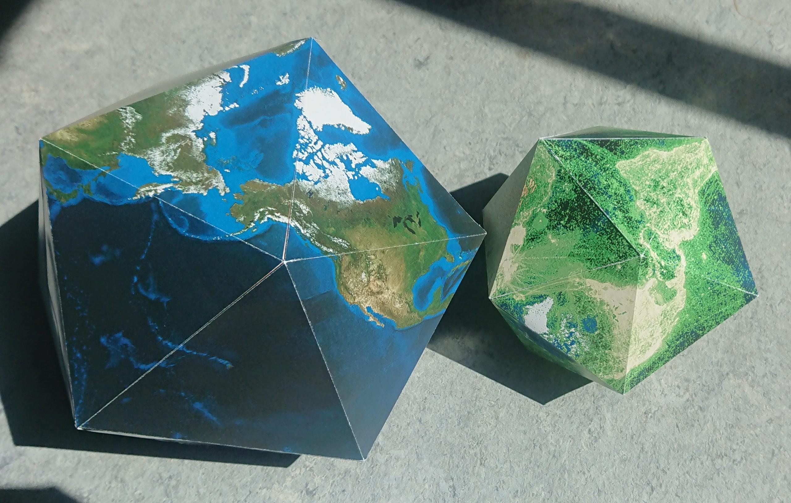
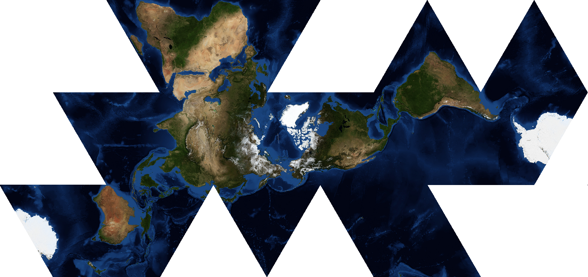

= GBIF Dymaxion Maps

The code in this repository can be used to generate a map in https://en.wikipedia.org/wiki/Dymaxion_map[Dymaxion projection], or an icosohedral net for a paper "globe".

 

See "https://github.com/MattBlissett/gbif-dymaxion/releases[Releases]" for PDFs to print.
